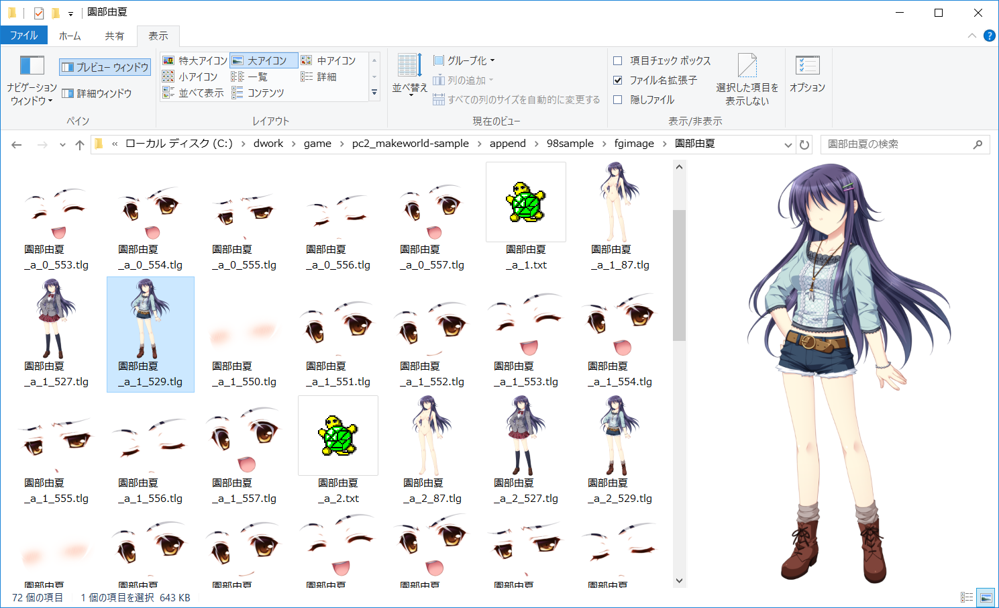

tlg-wic-codec
=============

KIRIKIRI TLG codecs for Windows Imaging Component

○ライセンス

WIC処理のオリジナルは MIT LICENSE の以下のコードです

dds-wic-codec 
http://code.google.com/p/dds-wic-codec

libtlg/ は吉里吉里に由来します
吉里吉里ライセンスに準拠します

●インストール方法

(1) ソースを取得してビルド

(2) コマンドプロンプト（開発者）から以下で登録できます

32bit版
```
> regsvr32 Release-Win32\tlg-wic-codec.dll 
```

64bit版
```
> regsvr32 Release-x64\tlg-wic-codec.dll 
```

WIC対応のビューワアプリで TLG 画像が参照可能になります

(3) サムネール用の登録を追加するとエクスプローラのサムネール表示とプレビュー表示に対応します

```
> reg import thumbnail.reg
```

※読み込んだあとタスクマネージャからエクスプローラの再起動が必要です

コマンドラインの場合は以下で可能です
```
> taskkill /IM explorer.exe /F & explorer.exe
```




●アンインストール方法

(1) サムネール指定削除

```
> reg import remove.reg
```

※読み込んだあとタスクマネージャからエクスプローラの再起動が必要です

コマンドラインの場合は以下で可能です
```
> taskkill /IM explorer.exe /F & explorer.exe
```


(2) コマンドプロンプト（開発者）から以下で WIC 登録を削除できます

32bit版
```
> regsvr32 /u Release-Win32\tlg-wic-codec.dll 
```

64bit版
```
> regsvr32 /u Release-x64\tlg-wic-codec.dll 
```

